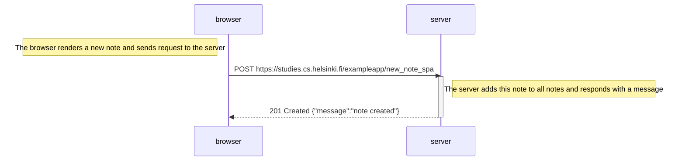

```mermaid
sequenceDiagram
    participant browser
    participant server

    Note left of browser: The browser renders a new note and sends request to the server
    browser->>server: POST https://studies.cs.helsinki.fi/exampleapp/new_note_spa
    activate server
    Note right of server: The server adds this note to all notes and responds with a message
    server-->>browser: 201 Created {"message":"note created"}
    deactivate server

```